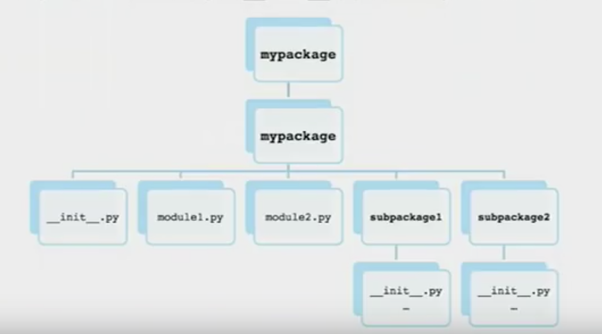
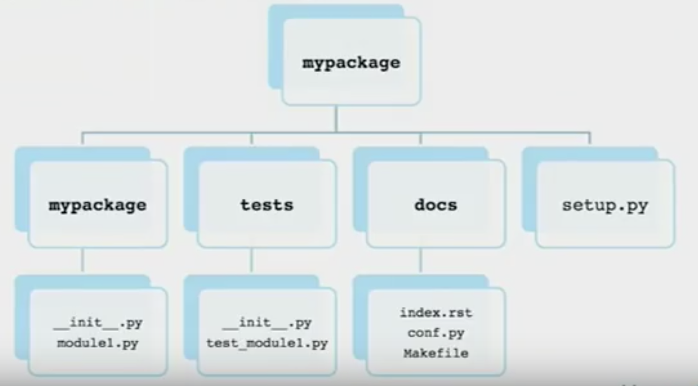

# Day 6 : Python packages
- Python packages are useful to wrap the modules and ship it to the server and use it anywhere.
- I wanted to document a good step by step tutorial for creating python packages for beginners so anyone can create a beautifully structured py pacakages.

## Modules vs. Packages
- Module can be just a file containing python code.
- Packages are folders which contain __init__.py file with other multiple python modules that interact with each other.

## Package structure
- It is important to structure the package to follow the convention so it is easy to read and find the codes.

- The outer folder wraps its other folder inside
- the second folder wraps all the sub-packages(folders), other modules(files), and __init__.py. The __init__ file makes this directory a module that can be accessible by other modules via imports.
- Each sub-package contains __init__ file to make their directory as a module too to enable imports.

- Add tests and docs folder in the upper most folder which contains its own __init__ file and modules that run its own tasks.
- For tests : various testing Modules
- For docs : modules that are needed for configuring for the installation of the package such as configuration files etc...
- setup.py : a list of instructions that installs the package using module setuptools.

## Using helper library to build the py pacakage
- PyScaffold is a simple to use library to build a py package template
- Recommend to use virtulenv
### Usage
1. Install PyScaffold `pip install pyscaffold`
2. Create a package with [package name] `putup [package name]`
3. Go to the package and build stuff ! `cd [package name]`
4. Versioning the package (in the same dir as setup.py) `git tag [version number]`
5. Compress a shippable package (in the same dir as setup.py) `python setup.py sdist`. You can use `bdist` for binary distribution package. `sdist` is for source distribution package
6. There should be a package in zip file format in /dist directory. You can import this file anywhere to be installed.
7. To install the package, go to where the zip file is located. `pip install [zip file name]`
8. To test if the package is installed. `python -c "import [package name]"`. If it runs without error, then the package is successfully installed.
