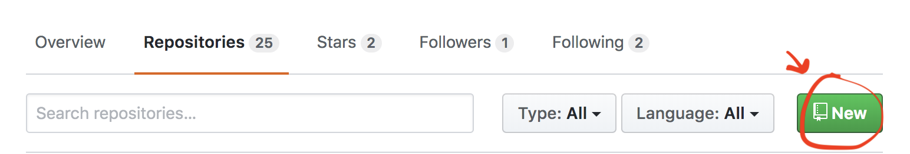
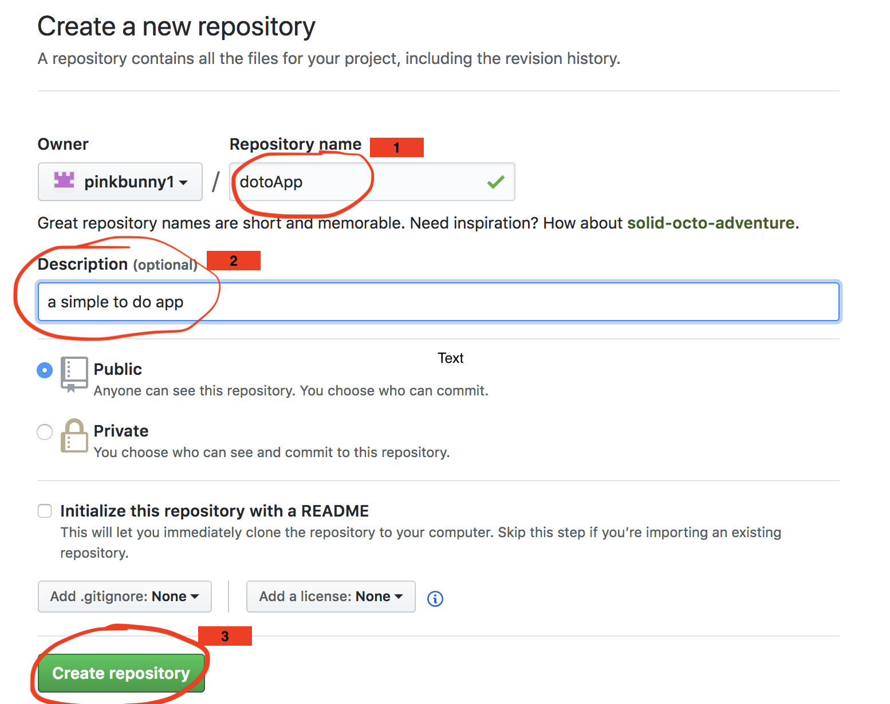
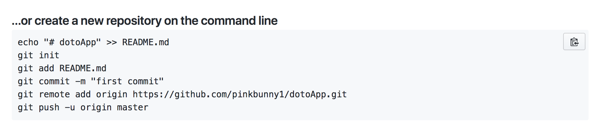
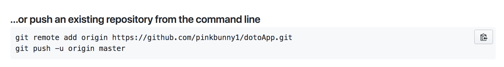

# Day 7 : Getting familiar with Git and Github
- Git is used widely and so it is crucial to understand the ins and outs of Git and Github especially for projects done in teams.
- It is also good to use Git as if working in a team while doing the solo projects
- Got inspired by [Blog Post on Git and Github](https://medium.freecodecamp.org/follow-these-simple-rules-and-youll-become-a-git-and-github-master-e1045057468f)
- The Author, Ariel Camus advocates the use of these 3 rules for becoming a master of Git and Github.
  - #1 Create git repo for every project
  - #2 For every feature added, create a branch for it
  - #3 To add the feature, use Pull Request to merge into the Master branch
- This Guide will start from creating a git repo to merge pull request for beginners who are not 100% familiar with Git and Github but worked with Git before mainly for solo projects.

### 1. Create a repository in Github account
- Create a repository in the Github account by clicking 'New' button.

- Fill in [1]Name of project, [2]Description, and [3]click 'Create Repository' as shown in the image below.

### 2-1. Start a new project and Add the new repository created above
- Creating a project folder(directory) `mkdir todoapp`
- Go into the project folder `cd todoapp`
- Add the git repository created in Step1 `Follow the command lines in the image below`

- `git init` is for initialising git repository in the project and it should be initialised in the root of project directory.

### 2-2. Add the new repository into existing project
- `Follow the command lines in the image below`

### 3. Add changes in the project to Git Staging Environment
- Whenever there is a change in the projects files, we need to add the changes to the git staging environment to let git know of the changes we want Git to follow.
- `Git add [path/to/name of file/s or folders]`

### 4. Commit the changes
- Committing changes in the project files is like creating a snapshot of all the changes in the added files in the git stating environment.
- `git commit -m "Your message about the commit"`
- The message must be relevant to the changes.

### 5. Adding a new feature: Create a branch
- Whenever there is a new feature to be added, add it by creating a new branch instead of adding it directly from the Master Branch.
- This is a good way to keep the core code isolated from the new features.
- Create a new branch `git checkout -b [name of a new branch, it can be anything]`
- To check the branches `git branch`. There should be a asterisk beside the branch to tell you which branch you are currently on

### 6. Add and commit from the new branch
(While being on a new branch, not the Master Branch)
- `git add [path to files]`
- `git commit -m "message"`
- `git push origin [name of branch]`

### 7. Pull Request to merge the branch with the master
- Go to the Repository in Github account
- Click branches
- Click the button where it says 'Compare and Pull Request'

### 8. Review and Confirm the Pull Request
-
